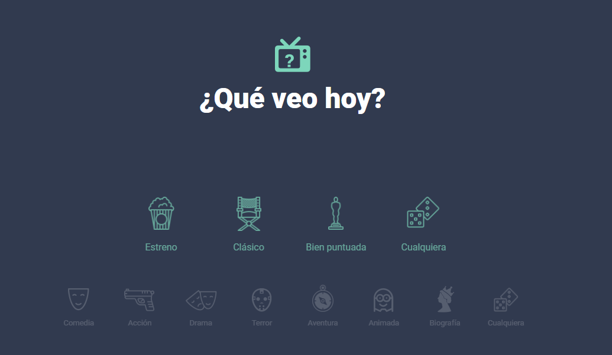

# Que Veo Hoy
Little movie recommendation web app to practice Node , Express, and SQL

# How it works
- The app is composed of a client, a server, and a DB.
- In the project you can find all the files for the client and server, and scripts to create and feed the tables and views of the DB.

# Client Configuration
At the top of all the .js files (expect the Jquery one) you can define the server variable of where the client fetchs data of that function.
Defaults to localhost:8080

# Server Configuration
- You can configure the port in the servidor.js file.
- You MUST enter the DB data in lib/conexionbd.js

# DB Config
- This was made with MySQL but of course you can use any SQL database changing the driver in the server.
- In the scripts folder you need to execute all the scripts in order.

